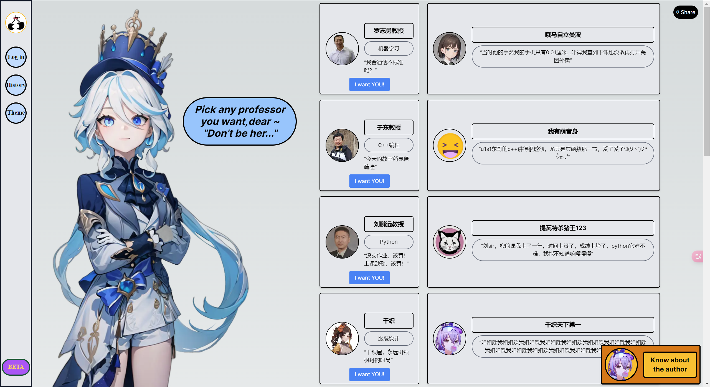
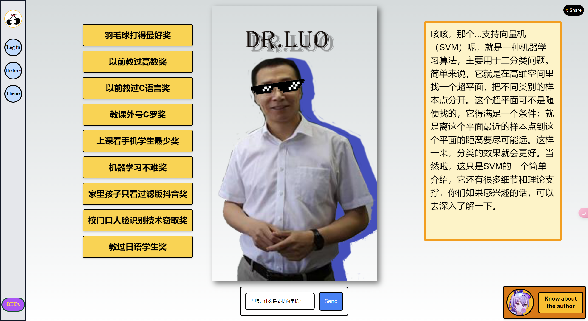
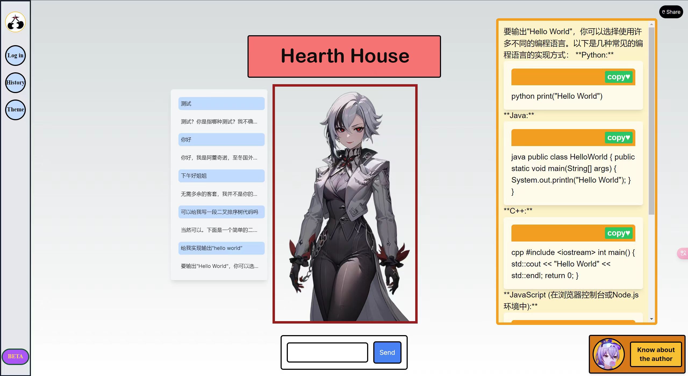

# AI-chatbot

<div>
<a target="_blank" href="https://space.bilibili.com/12595237?spm_id_from=333.1007.0.0">

 <p style="font-size: 14px; color: #333;">Contact me: <a href="mailto:yapuhu042228@163.com" style="color: #0066cc;">yapuhu042228@163.com</a> or <a href="mailto:shenruima@gmail.com" style="color: #0066cc;">shenruima@gmail.com</a></p>
</a>
</div>

## Special Announcement / 特别声明

As this project has been adopted by our university's college and is currently being integrated into the college's official website, this repository has temporarily ceased updates.The teaching content related to faculty members has been hidden."The GPT-SoVITS model that was previously released has also been temporarily taken down.

Nevertheless, you can still clone it to your local machine as a toy project to tinker with. Freshmen can take this opportunity to move beyond textbooks and get acquainted with more cutting-edge front-end and back-end tech stacks. (Abandon the HTML trinity; you deserve React + TailwindCSS, "Join the glorious evolution!")

由于本项目已经被本校学院采纳，正在整合进学院官网，故本仓库暂时停止更新。涉及到的教师教学内容已隐藏,曾经发布的 GPT-Sovits 模型也暂时下架。

尽管如此，您还是可以把它 clone 到本地作为一个 toy project 把玩。大一同学可以借机脱离课本，接触一下较为前沿的前后端技术栈。（抛弃 HTML 三大件，你值得 React + TailwindCSS,“加入光荣的进化吧”）

## Features / 特性

Virtual teachers at the School of Information Science, powered by ByteDance's Doubao large language model, utilize knowledge graphs to process teaching materials into a knowledge base. Currently, it has integrated a small portion of courseware from Data Structures and Introduction to Information Technology.

Some "Genshin Impact" character chatbots are presented in the form of one-on-one chat rooms, including: Hu Tao's Wangsheng Funeral Parlor, Arlecchino's Hearth House, and Chiori's Chiori House. Hu Tao and Arlecchino offer different styles of conversation, while Chiori House can generate realistic or anime-style artwork based on prompts.

1.信息科学学院虚拟教师，背后接入字节豆包大语言模型，利用知识图谱将教学课件处理成知识库。目前整合了小部分数据结构和信息技术导论的课件。

2.部分《原神》角色聊天机器人以 1 对 1 聊天室形式呈现，包括：胡桃的往生堂，阿蕾奇诺的壁炉之家，千织的千织屋。胡桃和阿蕾奇诺可以体验基于不同性格的对话，千织屋除了对话，可以额外基于 COmfyUI 项目运行，根据提示词绘画写实/二次元风格的 AI 绘画。
(当然，他们都可以帮你写代码作业)

## Usage / 使用

### Windows Installation / Windows 安装

```
git clone https://github.com/Shenrui-Ma/AI-chatbot.git
cd Reverse-Turing

.\install_env.bat

conda activate .\AI-chatbot\env

pip install -r requirements.txt

```

Run in the root directory / 在根目录下运行

```
./start.sh
```

### Linux Installation / Linux 安装

```
bash
git clone https://github.com/Shenrui-Ma/AI-chatbot.git
cd AI-chatbot

chmod +x install_env.sh
./install_env.sh

source ./miniconda/etc/profile.d/conda.sh
conda activate ./AI-chatbot

pip install -r requirements.txt
```

Run in the root directory / 在根目录下运行

```
bash
./start.sh
```

## Example / 例子






## Note / 说明

The program now integrates my personal ByteDance Doubao-pro-128k model API, but I'm unsure how long it will be available. If you want to use your own API, you can create a new .env file in the root directory and add the line API_KEY=<your API_KEY>.

现在程序集成了本人的百度 ERNIE-Bot 4.0 模型 API,不知道能用多久。如果要使用自己的，可以在根目录新建一个.env 文件，并写入 API_KEY=<你的 API_KEY>。

## Credits / 鸣谢

- [ComfyUI](https://github.com/comfyanonymous/ComfyUI)
- [GPT-SoVITS](https://github.com/RVC-Boss/GPT-SoVITS)
